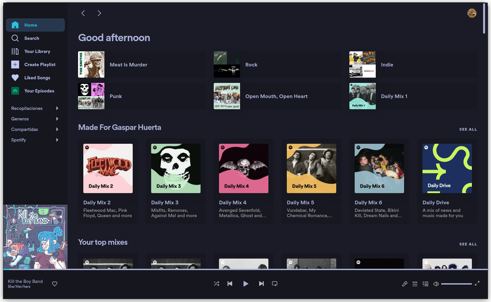
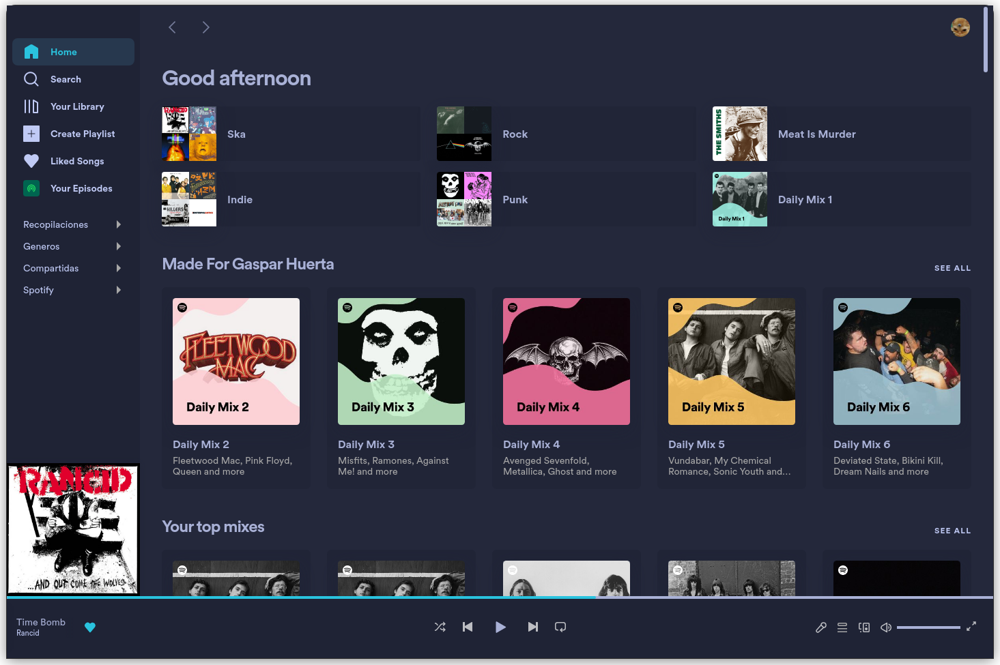
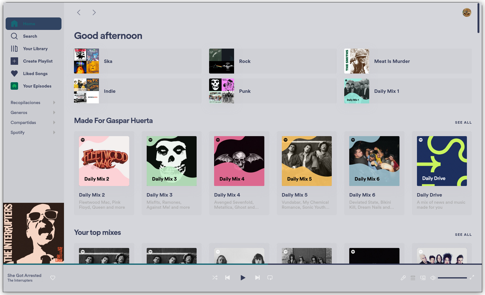

# Spotify Tokyo Night Theme

Spotify Tokyo Night Theme to use with [Spicetify](https://spicetify.app/); based on the famous [Tokyio Night VSCode colorscheme](https://github.com/enkia/tokyo-night-vscode-theme#color-palette) and on the [Spicetify Sleek theme](https://github.com/spicetify/spicetify-themes/blob/master/THEMES.md#sleek).

## Install

1. Install Spicetify: https://spicetify.app/docs/getting-started

2. Clone the repository.

   ````bash
   git clone https://github.com/Gspr-bit/Spotify-Tokyo-Night-Theme.git
   ````

3. Copy the files into `~/.config/spicetify/Themes`.

   ````bash
   mkdir ~/.config/spicetify/Themes/Tokyo
   cd Spotify-Tokyo-Night-Theme
   cp color.ini user.css ~/.config/spicetify/Themes/Tokyo
   ````

4. Apply the theme

   ````bash
   spicetify config current_theme Tokyo
   spicetify config color_scheme Night|Storm|Light
   spicetify apply
   ````


## Color Schemes

### Night



### Storm



### Light


